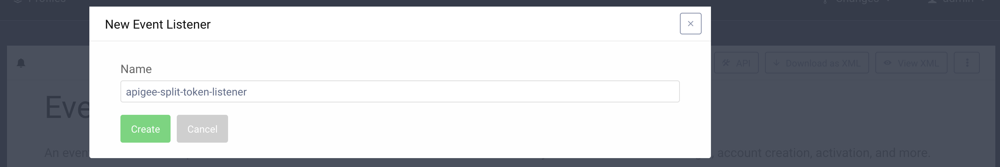
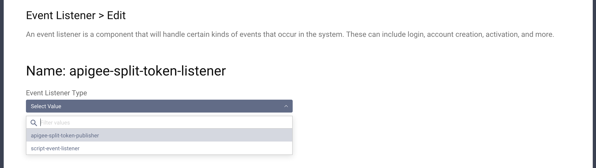
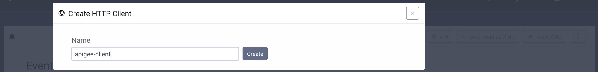
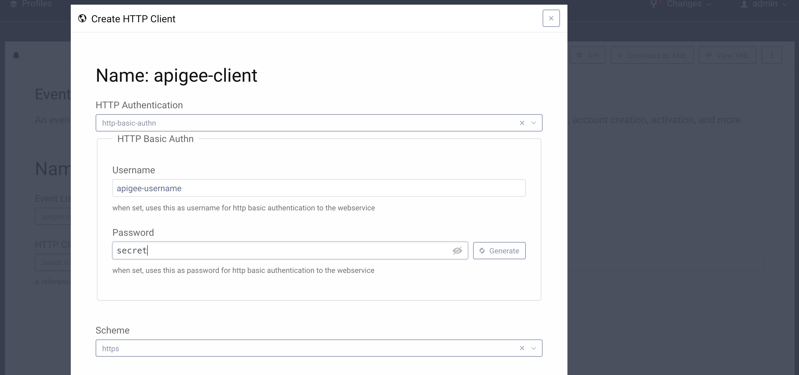
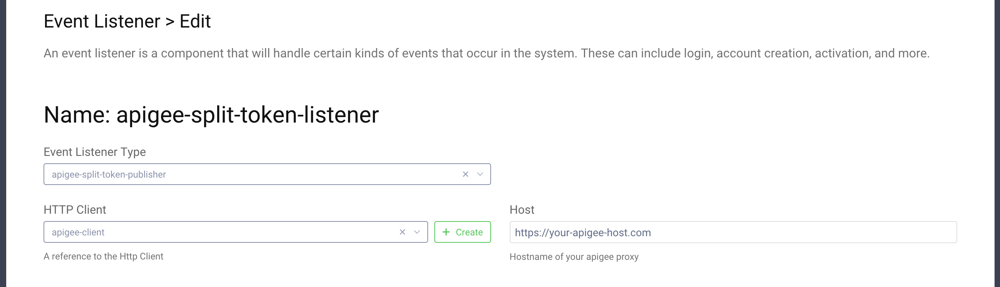

# Apigee Split Token Publisher Demo Plugin

This is an example event listener SDK Plugin for the Curity Identity Server. The plugin registers an event listener 
listening for issued access token events, and forwards them to Apigee Edge cache, using the Split Token approach.

## Building, installation and configuration

To build the plugin, simply download it and run `mvn package`. This creates `target/identityserver.plugins.events.listeners.apigee-split-token-publisher-1.0.0.jar`.
Create a new folder `apigee_split_token_publisher` in `<idsvr_home>/usr/share/plugins/` then copy the jar to that folder
and (re)start the Curity Identity Server. Configure a new event listener (shown here using the Admin UI, but might just
as well be configured through the CLI, REST or XML):

Pick a suitable name and then select the "apigee-split-token-publisher" type:

The Apigee token listener needs a http client configured for communication with Apigee Edge. Click the **+ Create** button
next to the **Http Client** dropdown and provide a name for the client:

Choose `http-basic-authn` as the **HTTP Authentication** mechanism and fill in the values for username and secret - these
have to match the **id** and **secret** that will be set in Apigee flow receiving these requests.

You can leave the rest of the options set to default. Click **Create** at the bottom of the form. Fill in the hostname
of your Apigee Edge:

Then Save and Commit the changes.

Please visit [curity.io](https://curity.io/) for more information about the Curity Identity Server.
